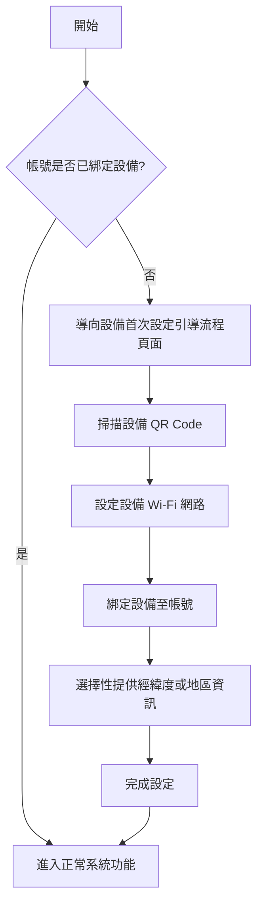

# 介紹
---
如果使用者的帳號尚未綁定任何設備，系統將自動導向一個專門的引導流程頁面，協助使用者完成設備的首次設定。在此流程中，使用者首先需要透過掃描設備上的二維碼（QR Code）來快速識別並連結設備。接著，系統會提示使用者設定設備的 Wi-Fi 網路，以確保設備能夠正常連線並上傳數據。完成網路設定後，使用者需進一步綁定設備至自己的帳號，以確保未來操作與資料管理的完整性。[^1]

在這個流程中，使用者也可以選擇性地提供設備所在的經緯度資訊或地區資料，以便系統能夠根據地理位置提供更精準的服務，例如天氣提示、區域化通知或遠端管理功能。整個流程設計簡單直觀，旨在讓新使用者能快速上手並順利完成設備綁定。

[^1]: 經緯度與地區為可選

