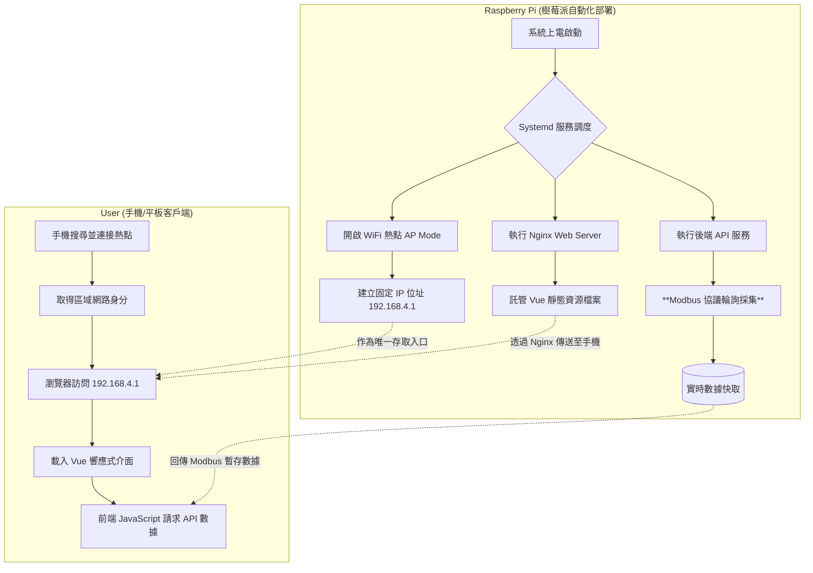

```mermaid
graph TD
    subgraph "Raspberry Pi (樹莓派自動化部署)"
        A[系統上電啟動] --> Boot{Systemd 服務調度}
        
        %% 網路層：基礎通訊環境
        Boot --> B[開啟 WiFi 熱點 AP Mode]
        B --> C[建立固定 IP 位址 192.168.4.1]
        
        %% 數據層：後端核心邏輯
        Boot --> F[執行後端 API 服務]
        F --> Modbus[**Modbus 協議輪詢採集**]
        Modbus --> Cache[(實時數據快取)]
        
        %% 應用層：前端網頁託管
        Boot --> D[執行 Nginx Web Server]
        D --> E[託管 Vue 靜態資源檔案]
    end

    subgraph "User (手機/平板客戶端)"
        G[手機搜尋並連接熱點] --> H[取得區域網路身分]
        H --> I[瀏覽器訪問 192.168.4.1]
        I --> J[載入 Vue 響應式介面]
        J --> K[前端 JavaScript 請求 API 數據]
    end

    %% 關鍵連線路徑
    C -.->|作為唯一存取入口| I
    Cache -.->|回傳 Modbus 暫存數據| K
    E -.->|透過 Nginx 傳送至手機| I
```
![[ChatGPT Image 2026年4月24日 下午04_29_42.png]]
