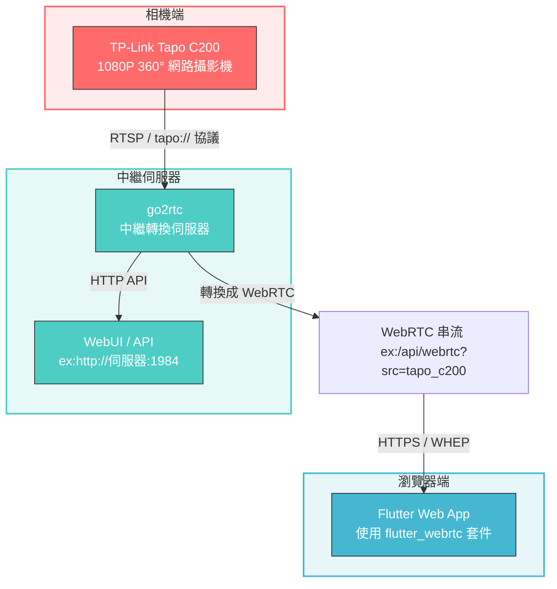

```mermaid
flowchart TD
    %% 定義節點
    A[TP-Link Tapo C200<br>1080P 360° 網路攝影機]

    -->|RTSP / tapo:// 協議| B[go2rtc<br>中繼轉換伺服器]

    B -->|轉換成 WebRTC| C[WebRTC 串流 <br>ex:/api/webrtc?src=tapo_c200]

    C -->|HTTPS / WHEP| D[Flutter Web App<br>使用 flutter_webrtc 套件]

    %% 控制與互動
    B -->|HTTP API| E[WebUI / API <br>ex:http://伺服器:1984]

    %% 子流程說明
    subgraph 相機端
        A
    end

    subgraph 中繼伺服器
        B
        E
    end

    subgraph 瀏覽器端
        D
    end

    %% 風格調整
    classDef camera fill:#FF6B6B,stroke:#333,color:white
    classDef server fill:#4ECDC4,stroke:#333,color:white
    classDef flutter fill:#45B7D1,stroke:#333,color:white
    

    class A camera
    class B,E server
    class D flutter

    %% Group 樣式（半透明背景 + 彩色邊框）
    classDef cameraGroup fill:#FF6B6B22,stroke:#FF6B6B,stroke-width:2px
    classDef serverGroup fill:#4ECDC422,stroke:#4ECDC4,stroke-width:2px
    classDef flutterGroup fill:#45B7D122,stroke:#45B7D1,stroke-width:2px

    class 相機端 cameraGroup
    class 中繼伺服器 serverGroup
    class 瀏覽器端 flutterGroup

    %% 關鍵：讓 subgraph 標題文字變成白色
    %%{init: {
        "theme": "base",
        "themeVariables": {
            "clusterBkg": "#2A2A2A80",     %% 半透明深灰背景
            "clusterBorder": "#555",
            "titleColor": "#FFFFFF",        %% ← 這行讓標題變白色
            "labelColor": "#FFFFFF"
        }
    }}%%
```

TapoC200
![[TapoC200.png|416]]
